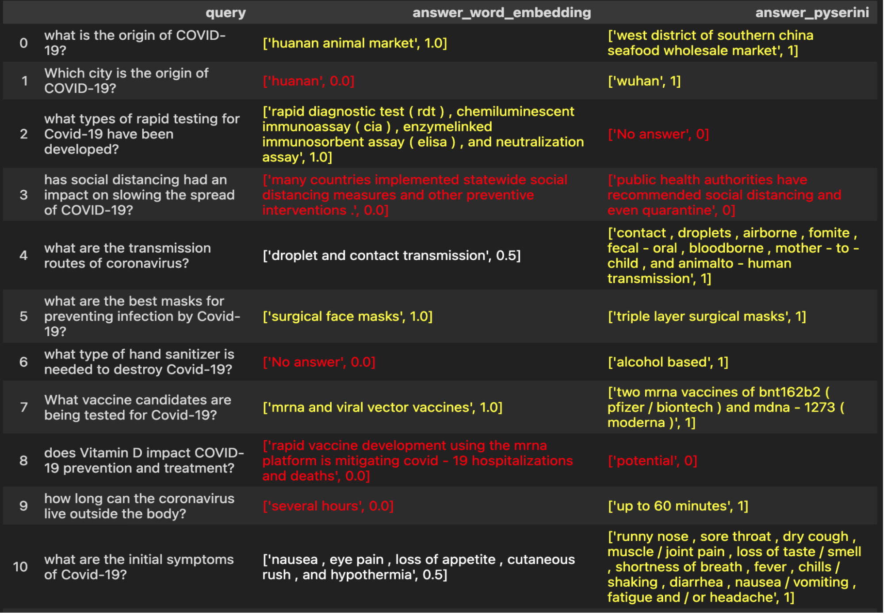

# Introduction
In this group project, we developed a Question Answering (QA) system based on the CORD-19 dataset. The goal of the system is to provide concise, natural language answers within a single sentence. Users have the option to listen to an audio version of the answer, and the approximate waiting time for the answer response is one minute.

Our QA system was implemented using two different methods, both of which were extended from our work in Assignment 2. The first method uses word embeddings and cosine similarity to retrieve relevant paragraphs in relation to the input question. The second method utilizes Pyserini, a powerful search library, to retrieve pertinent paragraphs.

To evaluate the performance of our QA system, we tested it with 22 different questions. The scoring criteria were as follows: fully correct answers received 1 mark, partially correct answers received 0.5 marks, and incorrect answers received 0 marks. The first method, using word embeddings and cosine similarity, achieved a score of 29.6/100, while the second method, employing Pyserini, scored significantly higher with 72.7/100.

# Result
